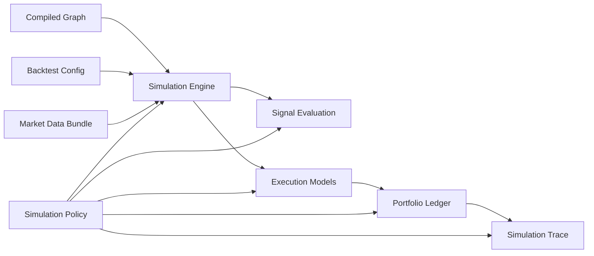

# Simulation Policies

Simulation policies are centralized rules that define how the backtester handles
ambiguous or tunable behavior.

These rules should not be scattered across execution code. They should be
documented, versioned, validated, and included in every backtest result.

## Why Policies Exist

Many backtesting choices are not facts. They are assumptions.

Examples:

- What happens if a sell action asks to sell more ETH than the portfolio owns?
- Should actions partially fill?
- How often can the same signal fire?
- What candle price should a market order use?
- How much slippage should be applied?
- Should gas be fixed or historical?
- What happens if data is missing?

If these rules are implicit, users will misunderstand the result.

If these rules are centralized, we can:

- make backtests reproducible
- compare strategy runs fairly
- expose assumptions in the UI
- tune realism over time
- test policy behavior directly
- support simple MVP behavior without painting ourselves into a corner

## Design Principle

The simulation engine should make decisions through a policy object.

```text
graph + config + market data + policies -> simulation result
```

The policy object should be:

- explicit
- serializable
- versioned
- validated
- included in output metadata

## Policy Location

Recommended ownership:

```text
schemas/
  simulation-policy.schema.json

crates/
  simulation-policies/

packages/
  contracts/
```

The Rust crate owns policy application during simulation. Python validates and
passes the selected policy profile into Rust.

## Policy Profiles

Start with named profiles.

```text
strict_v1
conservative_v1
research_v1
```

### `strict_v1`

Good for deterministic correctness and early testing.

Suggested behavior:

- insufficient balance rejects the action
- no partial fills
- signal fires on crossing only
- one action execution per signal fire
- fixed slippage unless configured
- missing required market data fails the run
- same-tick ordering is deterministic and documented
- liquidation checks run every tick

### `conservative_v1`

Good for less optimistic user-facing backtests.

Suggested behavior:

- insufficient balance rejects the action
- no partial fills unless action explicitly allows them
- worse-side candle execution
- higher slippage defaults
- historical gas where available
- missing optional data uses conservative fallback with warning
- same-candle threshold ambiguity resolves against the strategy

### `research_v1`

Good for quick exploratory analysis.

Suggested behavior:

- allow approximate fills
- allow fallback data
- use close price execution
- warn more than fail
- prioritize speed and broad coverage

## Policy Categories

### Balance Policy

Defines what happens when an action requests more asset than available.

Options:

```text
reject
partial_fill
clamp_to_available
allow_negative
```

Recommended MVP default:

```text
reject
```

Example:

```text
Action: sell 0.04 ETH
Available: 0.03 ETH
Policy: reject
Result: action rejected, portfolio unchanged, event recorded
```

Why not silently clamp?

Because it can hide strategy bugs. If a graph says "sell 0.04 ETH" but only has
`0.03 ETH`, the user should know the graph was not executable as written.

### Partial Fill Policy

Defines whether an action can execute partially.

Options:

```text
none
allow_if_configured
always_allow
```

Recommended MVP default:

```text
none
```

Partial fills are realistic for order-book markets but add complexity:

- what fraction filled?
- what price did each part fill at?
- what remained open?
- should the remaining order persist?

For early graph backtesting, action rejection is easier to reason about.

### Price Selection Policy

Defines which market data price is used for simulated execution.

Options:

```text
close
open
mid
next_open
worse_side_ohlc
order_book
amm_pool_state
```

The default is **`next_open`** (no intra-bar look-ahead): an order decided on a
bar fills at the *next* bar's open, since that bar's close isn't knowable when the
decision is made. `next_open` falls back to the current close only on the final
bar, where no next open exists. `strict_v1` uses `next_open`; `research_v1` uses
the more optimistic `close`.

Conservative profile can use:

```text
worse_side_ohlc
```

Example:

```text
Buy action in a 1h candle:
  open: 2000
  high: 2100
  low: 1950
  close: 2050

close policy fill: 2050
conservative worse-side fill: 2100
```

### Slippage Policy

Defines execution price adjustment. For the full per-model logic (formulas,
which market each fits, how to choose, and the swap-vs-perp scope), see
[logic/slippage-models.md](logic/slippage-models.md).

Options:

```text
fixed_bps
volume_based
order_book_depth
amm_price_impact
none
```

MVP default:

```text
fixed_bps
```

`amm_price_impact` is implemented for swaps (#40): when a `liquidity` (pool
reserve) series is present for the traded `(venue, symbol)`, the fill uses the
constant-product average price (`x·y=k`) for the trade size instead of a flat
bps — so large orders pay realistic impact and small orders don't. It falls back
to the reference price when no pool data is present. `order_book_depth` (HL perps)
is not modeled yet.

Example:

```text
Buy ETH at 2000 with 10 bps slippage:
  adjusted price = 2000 * 1.001 = 2002
```

For sells:

```text
Sell ETH at 2000 with 10 bps slippage:
  adjusted price = 2000 * 0.999 = 1998
```

### Fee Policy

Defines trading and protocol fees.

Options:

```text
fixed_bps
venue_fee_table
pool_fee_tier
none
```

MVP default:

```text
fixed_bps
```

Later:

- Hyperliquid fee schedule
- Uniswap pool fee tier
- Aerodrome fee model
- Aave protocol-specific costs

### Gas Policy

Defines gas cost behavior for on-chain actions.

Options:

```text
none
fixed_usd
fixed_native
historical_fee_history
historical_receipt_estimate
```

MVP default:

```text
fixed_usd or historical_fee_history
```

The chosen gas policy should distinguish:

- EVM swap
- EVM yield deposit
- EVM yield withdraw
- Hyperliquid HyperCore spot/perp action
- HyperEVM action

### Signal Trigger Policy

Defines when a signal causes downstream actions to execute.

Options:

```text
level
crossing
crossing_with_cooldown
once_per_backtest
once_per_position_state
```

Recommended MVP default:

```text
crossing
```

Example:

```text
ETH < 1900:
  false -> true: fire
  true -> true: do not fire
  true -> false: reset
```

### Repetition Policy

Defines whether actions can repeat.

Options:

```text
never
on_each_signal_fire
with_cooldown
max_count
```

MVP default:

```text
on_each_signal_fire
```

But because the signal trigger policy defaults to crossing, this still avoids
executing every tick while a condition remains true.

### Same-Tick Ordering Policy

Defines what happens when multiple signals/actions occur at the same timestamp.

Options:

```text
graph_order
topological_order
signals_first_then_actions
conservative_adverse_order
reject_ambiguous
```

Recommended MVP default:

```text
topological_order
```

For ambiguous candles, conservative simulations may choose:

```text
conservative_adverse_order
```

### Missing Data Policy

Defines what happens when market data is missing.

Options:

```text
fail
skip_tick
forward_fill
fallback_provider
interpolate
```

Recommended MVP default:

```text
fail for required data
```

Research profile may use:

```text
fallback_provider with warning
```

This applies to **intra-window gaps**, not just missing endpoints: the engine
checks each required candle series for holes *inside* the window (against the
interval grid). Under `fail` (strict_v1) an interior hole aborts the run; under
`forward_fill` (research_v1) it's a warning. The `POST /market-data/coverage`
API surfaces the same gaps (`completeness_pct` + `missing_ranges`) before a run.

### Perp Risk Policy

Defines margin, liquidation, and funding behavior.

Policy knobs:

- margin mode
- liquidation model
- funding accrual interval
- mark price source
- max leverage behavior
- reduce-only validation

MVP defaults:

- isolated-position approximation unless venue data requires otherwise
- liquidation check every tick
- historical funding when available
- reject invalid reduce-only actions

### Yield Accrual Policy

Defines how yield positions grow.

Options:

```text
simple_apr
compound_apy
protocol_index
receipt_token_price
```

MVP default:

```text
simple_apr over elapsed time
```

Better Aave model:

```text
use liquidity index / aToken accounting
```

## Example Policy Object

```json
{
  "schema_version": "catalyst.backtest.policy.v1",
  "profile": "strict_v1",
  "balance": {
    "insufficient_balance": "reject"
  },
  "fills": {
    "partial_fills": "none",
    "price_selection": "next_open",
    "slippage": {
      "model": "fixed_bps",
      "bps": "10"
    },
    "fees": {
      "model": "fixed_bps",
      "bps": "5"
    }
  },
  "gas": {
    "model": "historical_fee_history",
    "fallback": {
      "model": "fixed_usd",
      "amount": "0.25"
    }
  },
  "signals": {
    "trigger": "crossing",
    "repeat": "on_each_signal_fire",
    "cooldown": null
  },
  "ordering": {
    "same_tick": "topological_order"
  },
  "data": {
    "missing_required": "fail",
    "missing_optional": "warn"
  },
  "perps": {
    "liquidation_check": "every_tick",
    "funding": "historical",
    "reduce_only_validation": "strict"
  },
  "yield": {
    "accrual": "simple_apr"
  }
}
```

## Where Policies Fit In The Simulation



## Result Metadata

Every backtest result should include the fully resolved policy object.

```json
{
  "result": {},
  "metadata": {
    "policy": {
      "profile": "strict_v1",
      "balance": {
        "insufficient_balance": "reject"
      }
    }
  }
}
```

This makes results explainable:

```text
This action failed because strict_v1 rejects insufficient balances.
```

## Testing Policies

Each policy should have direct tests.

Example fixtures:

- sell more spot than available
- buy with insufficient USDC
- same candle crosses buy and sell thresholds
- missing funding data
- reduce-only close with no open position
- gas data missing for EVM swap
- liquidation intra-period

Expected behavior should be stored in golden tests.

## Product UX Implication

The UI should expose policies at two levels:

1. Simple profile selector:

```text
Strict
Conservative
Research
```

2. Advanced assumptions drawer:

```text
Balance: reject insufficient
Fill price: close
Slippage: 10 bps
Gas: historical with fixed fallback
Signal trigger: crossing
Missing data: fail required
```

Users should not need to understand every knob to run a backtest, but they must
be able to inspect the assumptions behind the result.

