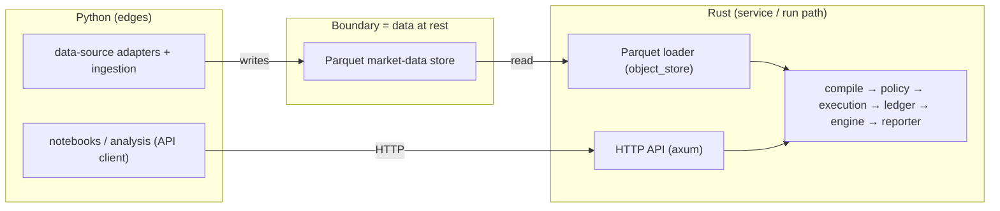
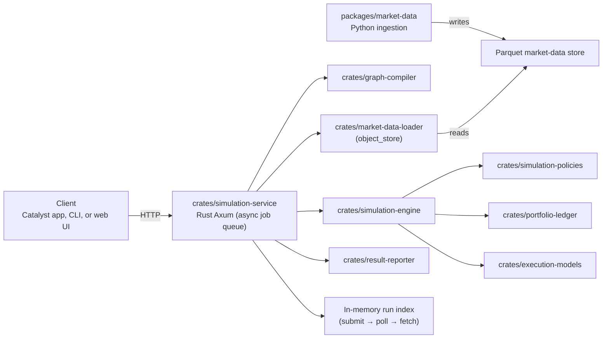
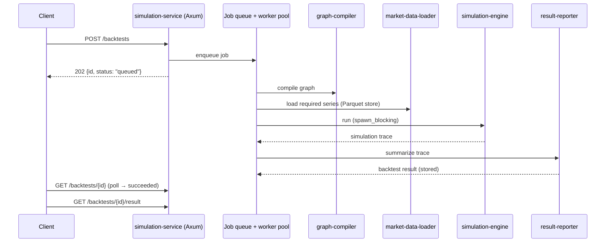

# System Design

## Goal

Build a backtesting system that accepts a runnable Catalyst graph, a time range,
and execution assumptions, then returns strategy performance, event traces, and
the final portfolio.

The design should support:

- EVM swaps
- Hyperliquid spot swaps
- Hyperliquid perp open/close orders
- EVM yield deposit/withdraw actions
- price-threshold signals
- deterministic replay over historical market data

Out of scope for the first version:

- options
- prediction markets
- live trading
- fully realistic DEX routing
- order-book level execution
- runtime language switching

## Language boundary (ADR 0001)

The deterministic **service/run path is Rust**; **Python is a client + data
plumbing only**. See [adr/0001-language-boundary.md](adr/0001-language-boundary.md).



- **Rust owns**: contracts (serde), compile, policy, execution, ledger, engine,
  Parquet loader, reporter, orchestration, HTTP API.
- **Python owns**: ingestion (writes the store) and analysis (calls the API).
- **No domain logic crosses the boundary.** The only cross-language overlap is
  data *shapes* (the JSON-Schema contracts below), single-sourced and
  fixture-guarded.

This resolves the duplication in #28 and the JSON-bundle boundary in #29.

> **Migration complete (#43).** The run path now lives entirely in Rust. The
> Python run-path packages (`graph-compiler`, `result-reporter`, `backtest-worker`,
> `backtest-api`) have been retired; their behavior is provided by the
> `crates/graph-compiler`, `crates/result-reporter`, and `crates/simulation-service`
> crates. Python keeps only `contracts` (data shapes) and `market-data`
> (ingestion). The descriptions below reflect that end state.

## Repository Shape

```text
catalyst-backtest/
  Cargo.toml
  pyproject.toml

  schemas/
    graph.schema.json
    backtest-request.schema.json
    backtest-result.schema.json
    market-data-bundle.schema.json
    simulation-policy.schema.json
    simulation-trace.schema.json

  crates/
    contracts/
    graph-compiler/
    simulation-policies/
    portfolio-ledger/
    execution-models/
    market-data-loader/
    simulation-engine/
    result-reporter/
    simulation-service/

  packages/
    contracts/
    market-data-core/
    market-data/
    market-data-dune/
    market-data-bigquery/
    client/            # catalyst-bt CLI

  apps/
    web/

  tests/
    fixtures/
    golden/
    conformance/

  infra/
```

Rust packages are crates. Python packages are packages. No `-rs` or `-py`
suffixes are needed because the folder tells us the implementation language.

## System Box Graph



A backtest is submitted to the service, which enqueues it; a bounded worker pool
compiles the graph, loads market data from the Parquet store, runs the engine,
and summarizes — all in-process, no internal HTTP hop. Clients poll status and
fetch the result when it's ready.

## Package Responsibilities

### `schemas/`

Language-neutral contracts.

Start with JSON Schema because it is easy to inspect, easy to fixture, and works
well across Python, Rust, TypeScript, and HTTP.

Core schemas:

- Catalyst graph
- backtest request
- backtest result
- normalized market data bundle
- simulation trace
- portfolio snapshot
- trade event
- error/warning object

### `packages/contracts`

Python models generated from, or manually aligned to, `schemas/`.

Likely tools:

- Pydantic
- datamodel-code-generator, if generation becomes worth it

### `crates/contracts`

Rust structs aligned to `schemas/`.

Likely tools:

- `serde`
- `serde_json`
- `schemars`, if Rust should emit schemas later

### `crates/graph-compiler`

Validates and normalizes Catalyst graphs. The simulation engine and service
consume it directly (resolving the duplication in #28).

Responsibilities:

- parse graph JSON
- reject disabled or malformed nodes
- validate edge references
- identify initial actions
- identify signal-driven actions
- normalize action configs into typed internal operations
- produce data requirements for the market-data loader

Open semantic decisions:

- whether signal nodes fire on level or crossing
- how repeated actions are represented
- how action-to-action edges should delay or sequence actions
- how to handle multiple incoming edges

### `packages/market-data` (Python — ingestion)

Fetches historical data from external sources and writes it to the Parquet store.
It does **not** run graphs or assemble bundles for the engine (that's the loader's
job); it only fills the durable store.

Responsibilities:

- fetch candles (Binance klines reference), funding (Hyperliquid), gas (EVM RPC),
  and yields (DefiLlama/Aave)
- normalize to the `catalyst_contracts` series types
- write partitioned Parquet to the historical store (incremental, merge-by-ts)

Data sources:

- Binance klines for deep, free, keyless candle history
- Hyperliquid official API for recent spot/perp candles and funding
- DefiLlama for Aave yield history
- Base/EVM RPC (`eth_feeHistory`) for recent gas, with flat-estimate backfill

### `crates/market-data-loader`

Reads the Parquet store for the run path (#29). Given a compiled graph's data
requirements and a window, it loads exactly the required series via `object_store`
(local / `s3://` / `gs://`) and returns a `MarketDataBundle` for the engine. The
engine never fetches raw data.

### `crates/simulation-service`

The user-facing HTTP API and orchestrator (Axum). Backtests are **asynchronous**:
submit enqueues a job; a bounded worker pool compiles → loads data → runs the
engine → summarizes in-process (CPU work on `spawn_blocking`); clients poll status
and fetch the result. A low-level `POST /simulate` (inputs in, raw trace out) is
also exposed for direct engine access. See the [service README](../crates/simulation-service/README.md).

### `crates/simulation-engine`

Pure deterministic simulation.

Responsibilities:

- run the event loop
- evaluate signal state at each tick
- schedule executable actions
- call execution models
- update portfolio ledger
- accrue funding and yield
- mark positions to market
- produce snapshots and events

The engine should not fetch raw market data.

### `crates/simulation-policies`

Centralized rules for ambiguous or tunable simulation behavior.

Responsibilities:

- insufficient balance behavior
- partial fill behavior
- execution price selection
- slippage model selection
- fee model selection
- gas model selection
- signal trigger behavior
- same-tick ordering
- missing data behavior
- perp risk policy
- yield accrual policy

Policies should be explicit, versioned, serializable, validated, and included in
every backtest result.

See [simulation-policies.md](simulation-policies.md).

### `crates/portfolio-ledger`

Deterministic accounting.

Responsibilities:

- cash balances by venue/chain
- token balances by venue/chain
- spot inventory
- perp positions
- collateral and margin
- realized and unrealized PnL
- fee, gas, funding, and yield entries
- final portfolio valuation

### `crates/execution-models`

Venue/action simulation.

Initial models:

- Hyperliquid spot market swap
- Hyperliquid perp market open/close
- EVM swap with price + fee + slippage + gas approximation
- Aave-style yield deposit/withdraw with rate accrual

### `crates/result-reporter`

Turns raw trace into user-facing results (called in-process by the service).

Responsibilities:

- equity curve
- drawdown
- final portfolio
- trade log
- position history
- costs breakdown
- assumptions summary
- warnings and data coverage notes

## Request Flow

All in one Rust service; ingestion (Python) runs out-of-band, writing the store.



## First API Shape

```http
POST /backtests
GET /backtests/{id}
GET /backtests/{id}/result
GET /backtests/{id}/events
```

`POST /backtests` accepts:

```json
{
  "graph": {},
  "policy": {
    "profile": "strict_v1"
  },
  "config": {
    "start": "2024-01-01T00:00:00Z",
    "end": "2024-06-01T00:00:00Z",
    "interval": "1h",
    "initial_portfolio": {
      "base": { "USDC": "1000" },
      "hyperliquid": { "USDC": "1000" }
    },
    "execution": {
      "signal_trigger": "crossing",
      "slippage_bps": "10",
      "gas_model": "historical",
      "action_cooldown": "1h"
    }
  }
}
```

## Simulation Defaults

Initial defaults should be explicit and visible in every result:

- bar-based simulation
- `1h` interval unless configured otherwise
- signal fires on crossing, not continuously
- initial actions execute at start time
- action-to-action edges execute immediately after prior success
- fixed slippage until better venue models exist
- historical gas where available, fixed fallback otherwise
- insufficient balance causes action rejection, not negative balances
- perp liquidation is checked every tick

These defaults should be implemented through centralized simulation policies, not
scattered through execution code. See [simulation-policies.md](simulation-policies.md).

## Data Strategy

Use a normalized data bundle as the input to Rust.

Benefits:

- Rust stays deterministic
- fixtures are easy to test
- data source changes do not force simulation changes
- same simulation can run from cached data, fixtures, or live fetches

Storage:

- local Parquet for candles/rates/events (dev)
- **Cloudflare R2** (object storage) for the shared/prod market-data store — the
  Rust loader reads it directly via `object_store`
- run/result artifacts are currently held in the service's in-memory run index
- (possible later: DuckDB for local querying, Postgres for durable job metadata)

The service is deployed to **Fly.io** (`https://catalyst-backtest-api.fly.dev`)
and the web workbench to **Cloudflare Pages**
(`https://catalyst-backtest-web.pages.dev`); see `infra/`.

## Testing Strategy

### Fixture Tests

Small deterministic market data fixtures:

- ETH flat
- ETH crosses below threshold
- ETH crosses above threshold
- ETH gaps through multiple thresholds
- funding positive/negative
- gas spike
- yield rate changes

### Golden Graphs

Use the sample graphs from the problem statement.

Each golden test should define:

- graph
- config
- initial portfolio
- market data fixture
- expected trades
- expected final balances
- expected warnings/errors

### Conformance Tests

If a package moves language in the future, it must pass the same fixtures. We do
not need runtime language switching, but we do need stable behavior.

## UI/UX Notes

The first wireframe was useful because it exposed what probably does not work:

- the app may not want a large freeform graph canvas as the dominant surface
- the core workflow may be closer to "configure, run, inspect assumptions,
  compare outcomes" than "draw a graph"
- Catalyst may already own graph creation, so this app might be primarily a
  backtest review and debugging surface

Open UI questions:

- Is the backtest UI embedded inside Catalyst, or is it a separate workbench?
- Does the user edit graphs here, or only inspect graphs produced elsewhere?
- Should the primary screen be run setup, result analysis, or graph debugging?
- How much should the UI expose low-level assumptions such as slippage, gas,
  funding, fill model, and trigger behavior?
- Who is the first user: strategy creator, protocol engineer, investor/researcher,
  or internal QA?

Potential product surfaces:

1. **Run setup:** graph summary, time range, portfolio, assumptions, data coverage.
2. **Result analysis:** equity, drawdown, trades, final portfolio, costs, assumptions.
3. **Graph debugging:** why each signal fired, why actions executed/rejected.
4. **Comparison:** compare configs, intervals, or execution assumptions.
5. **Data audit:** show source coverage, missing periods, stale data, fallbacks.

The next UI discussion should start from the user's workflow, not from visual
layout. The most important question is: what decision is the user trying to make
after a backtest finishes?
