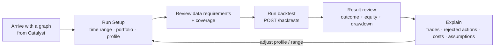

# Web App — First Workflow & Screen IA

> **Status: superseded by the shipped app (kept for the original v1 framing).**
> The workbench has since been built and grown past this spec — see
> [`apps/web/`](../apps/web/) and its [README](../apps/web/README.md). What
> changed: the two screens below became **six views** across a 4-route nav
> (Run Setup, Market Data, History, and a Run Details view with Result Review /
> Market Replay / Event Lens tabs); the "deferred" tech stack is decided
> (React 19 + Vite + TypeScript + Mantine + Storybook); and graphs arrive from a
> **bundled strategy repository** (`GET /strategies`) selected in-app with
> editable variables, rather than being passed in from Catalyst. The product
> thesis below (separate workbench, result-review-first, no freeform graph
> canvas) still holds.

This document settled the **first workflow** for the web app (issue #12). It is
grounded in the contracts and API that already exist in this repo (`POST
/backtests`, the policy profiles, and `backtest-result.schema.json`).

## Decisions (answers to the open questions)

| Open question | Decision (v1) |
| --- | --- |
| Embedded in Catalyst or separate? | **A separate "backtest workbench"** that Catalyst links into, passing a graph. It is not embedded in the graph editor. |
| Does the user arrive with a graph? | **Yes.** Graphs are authored in Catalyst. The workbench receives a runnable graph and does not edit it (v1). |
| Builder, notebook, or audit tool? | **An analysis + audit tool**, not a builder. The dominant surface is *result review with visible assumptions*, not a graph canvas. |
| First user? | **The strategy author** validating a graph before running it live — "would this have worked, and can I trust the result?" |
| Primary job? | **"Would this graph have made money, and why?"** — outcome first, explanation one click away. |
| What assumptions must be visible by default? | The **policy profile** (Strict/Conservative/Research) and the headline knobs it implies (fill price, slippage, gas, signal trigger, missing-data handling), plus **data coverage** warnings. |

These choices deliberately drop the freeform graph canvas as the dominant surface
(see [ui-ux-questions.md](ui-ux-questions.md)).

## The workflow (happy path)



1. **Run setup** — the user confirms time range, initial portfolio, and picks a
   **policy profile**. The compiled graph's **data requirements** and any coverage
   gaps are shown *before* running, so a run isn't wasted on missing data.
2. **Run** — `POST /backtests`; poll `GET /backtests/{id}` until `succeeded`/`failed`.
3. **Result review** — headline outcome (final value, return %, max drawdown) with
   equity + drawdown curves. Caveats (warnings, incomplete coverage) surface up top.
4. **Explain** — drill into the trade log, **rejected actions** (with the policy
   reason), the costs breakdown (fees/gas/funding/yield), and the resolved
   assumptions. Every number is traceable to an assumption.
5. **Iterate** — change the profile or range and re-run; runs for a graph are
   listed so results can be compared.

Maps directly onto the existing API: `POST /backtests`, `GET /backtests/{id}`,
`GET /backtests/{id}/result`, `GET /backtests/{id}/events`.

## Initial screen IA

### Screen 1 — Run Setup

```text
┌─────────────────────────────────────────────────────────────┐
│ Graph: <name>            ● valid / ✕ invalid (compile errors) │
├───────────────┬─────────────────────────┬───────────────────┤
│ Graph summary │ Run configuration       │ Data & assumptions │
│ (node list,   │ - start / end           │ - data required    │
│  signals →    │ - interval              │   (candles/funding/ │
│  actions)     │ - initial portfolio     │    gas/yields)     │
│               │ - policy profile        │ - coverage / gaps  │
│               │   (Strict/Cons./Research)│ - assumptions drawer│
├───────────────┴─────────────────────────┴───────────────────┤
│ Run history for this graph            [ Run backtest ]        │
└─────────────────────────────────────────────────────────────┘
```

### Screen 2 — Result Review

```text
┌─────────────────────────────────────────────────────────────┐
│ Final value $X · Return +Y% · Max DD −Z%   ⚠ caveats          │
├───────────────────────────────┬─────────────────────────────┤
│ Equity curve                  │ Final portfolio              │
│ Drawdown curve                │ Assumptions (resolved policy)│
├───────────────────────────────┴─────────────────────────────┤
│ Timeline: signals fired · trades · rejected actions          │
│ Costs: fees · gas · funding · yield                          │
└─────────────────────────────────────────────────────────────┘
```

Both screens read entirely from `backtest-result.schema.json` +
`simulation-trace.schema.json`; no field is invented beyond the contracts.

## Tech direction (deferred, not decided here)

The app shell/framework is intentionally **not** chosen in this issue. `apps/web`
stays a placeholder until the UI implementation issue starts. The only hard
constraint: the frontend consumes the existing JSON contracts and the
`simulation-service` endpoints.

## Ready-to-file UI implementation issue

> **Title:** Implement web app v1 — Run Setup + Result Review
>
> **Scope:** Build the two screens in [web-app-workflow.md](web-app-workflow.md)
> against the `simulation-service` endpoints.
>
> **Deliverables**
> - Run Setup screen: graph summary, run config (range/interval/portfolio),
>   profile selector, data-requirements/coverage panel, assumptions drawer.
> - Result Review screen: headline outcome, equity + drawdown charts, final
>   portfolio, trade/rejected-action timeline, costs breakdown, resolved
>   assumptions.
> - API client for `POST /backtests` + the three `GET` endpoints, with run polling.
> - Run history list per graph.
>
> **Acceptance**
> - Both screens render from a real `backtest-result` payload.
> - Policy profile and data-coverage warnings are visible by default.
> - Invalid graphs/configs surface the API's stable error.
> - No graph editing in v1.
